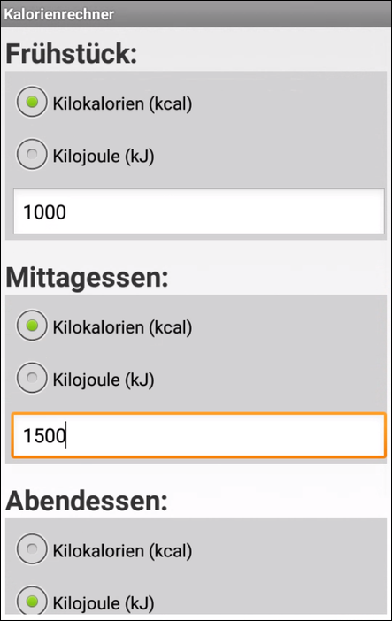
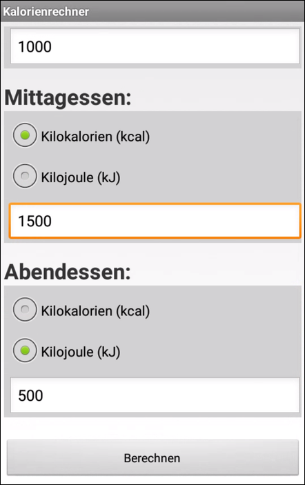

# Android-App "Kalorienberechnung" #

 

Simple Android app that shows how to use [fragments](https://developer.android.com/guide/components/fragments). 
The app defines a fragment for the entry of the energy value of a meal (e.g. lunch); using two radio buttons
it is selected if the value is to be interpreted in unit kCal (Kilocalorie) or kJ (Kilojoule).
The only activity (screen) of the app contains three instances of this fragment for entry of the energy
of three meals (breakfast, lunch, supper).
Upon pressing on a button the sum of these three meals is calculated and displayed.

 

**Note:** 1 kcal = 4,1868 kJ

 

See also [this repository](https://github.com/MDecker-MobileComputing/Android_Fragment) for another example on how to use fragments in an Android app.

 

Identifiers (names for classes, variables and methods), UI text and (JavaDoc) comments are in German only.

 

----

## Screenshots ##

 

 

----

## License ##

 

See the [LICENSE file](LICENSE.md) for license rights and limitations (BSD 3-Clause License).

 
